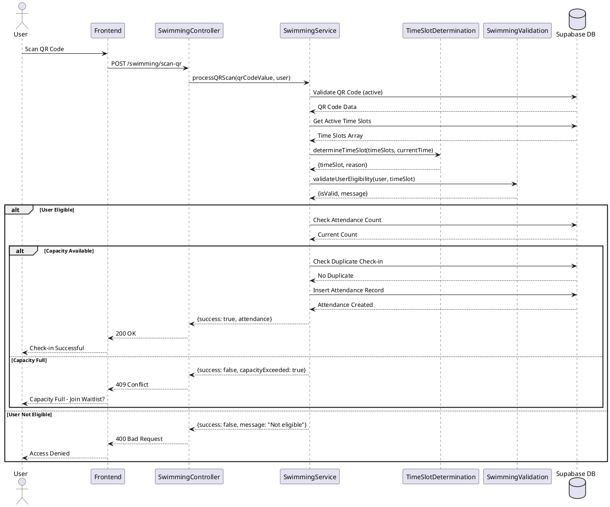
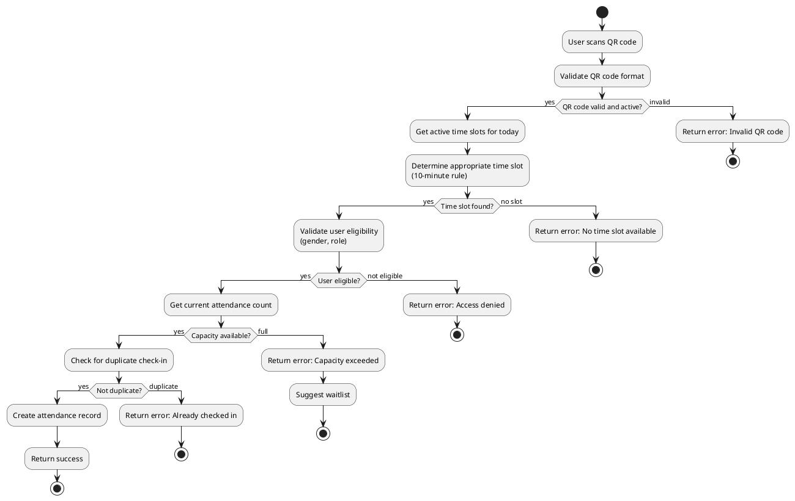
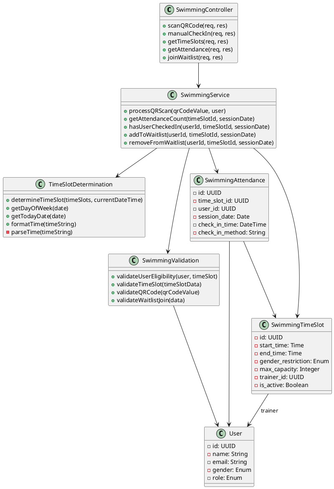
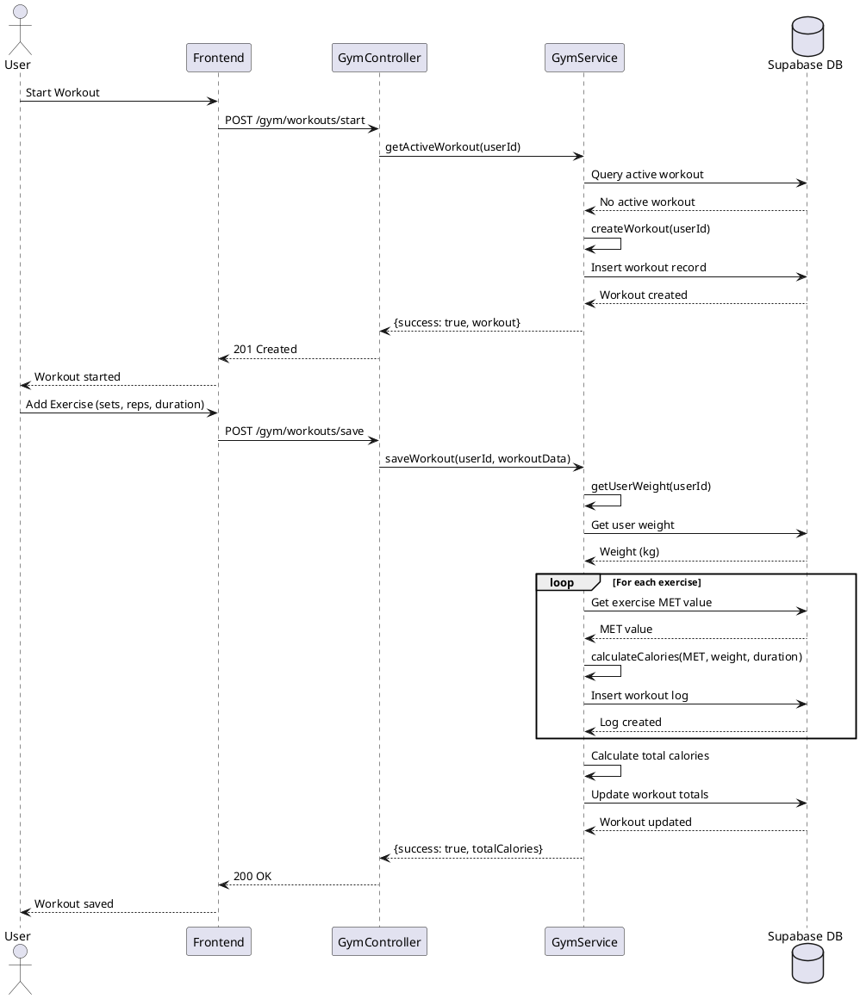
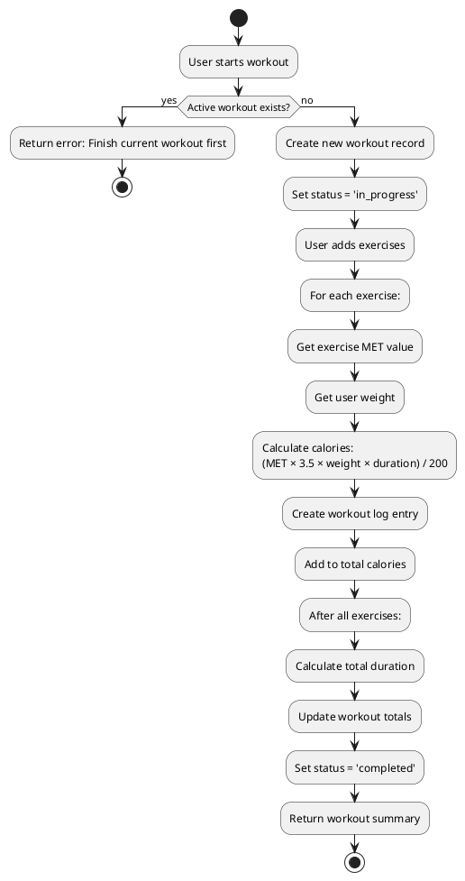
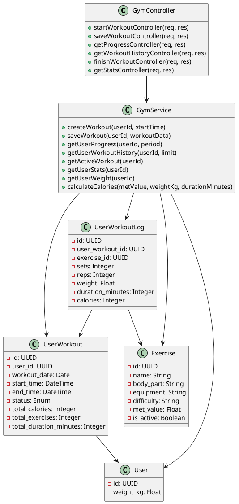
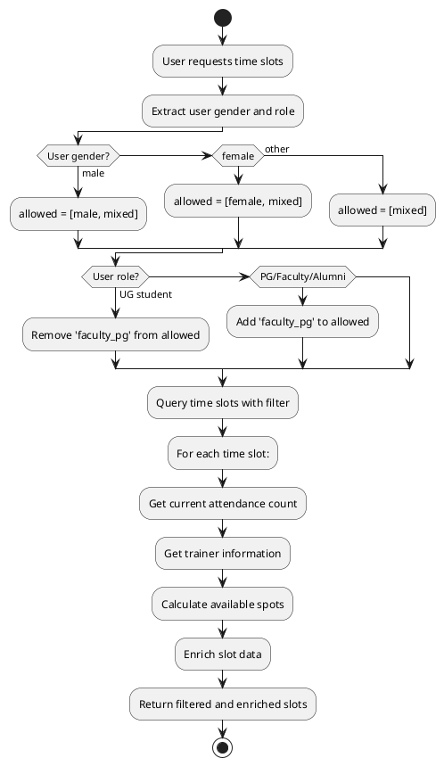
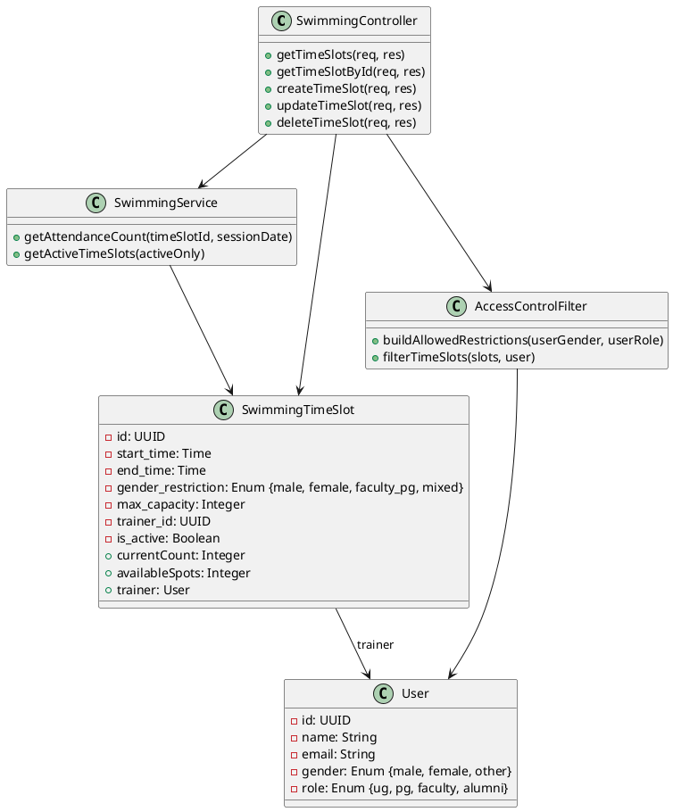

# Sportivex: Design, Specifications, and Code Review

## Table of Contents
1. [Design and Modeling](#1-design-and-modeling)
2. [Specifications](#2-specifications)
3. [Code Review](#3-code-review)

---

## 1. Design and Modeling

### Scenario Question 1: QR Code Scanning System for Swimming Pool Attendance

**Question:** Design a system for QR code-based attendance check-in at the swimming pool. The system should automatically determine the appropriate time slot based on the current time using a 10-minute rule, validate user eligibility based on gender restrictions, and enforce capacity limits.

**Explanation:**
The QR code scanning system implements a sophisticated time slot determination algorithm that considers the current time relative to available slots. The 10-minute rule allows early check-ins if a user arrives within 10 minutes of the next slot. The system enforces gender-based access control (male-only, female-only, faculty_pg, mixed) and prevents capacity overflow. This design follows separation of concerns by delegating validation, time slot determination, and business logic to separate service layers.

**PlantUML Diagrams:**

#### Sequence Diagram


#### Activity Diagram


#### Class Diagram


---

### Scenario Question 2: Gym Workout Tracking and Calorie Calculation System

**Question:** Design a system for tracking gym workouts where users can start a workout session, add exercises with sets, reps, and duration, and automatically calculate calories burned based on MET (Metabolic Equivalent of Task) values and user weight.

**Explanation:**
The gym workout system implements a modular design where workout creation, exercise logging, and calorie calculation are separated into distinct services. The calorie calculation uses the standard MET formula: `calories = (MET × 3.5 × weight_kg × duration_minutes) / 200`. The system maintains workout state (in_progress, completed, abandoned) and prevents multiple active workouts per user. This design follows the Single Responsibility Principle, with each service handling a specific concern.

**PlantUML Diagrams:**

#### Sequence Diagram


#### Activity Diagram


#### Class Diagram


---

### Scenario Question 3: Time Slot Management with Gender-Based Access Control

**Question:** Design a system for managing swimming pool time slots that automatically filters available slots based on user gender and role (UG student, PG student, faculty, alumni). The system should enforce gender restrictions (male-only, female-only, faculty_pg, mixed) and prevent unauthorized access.

**Explanation:**
The time slot management system implements a sophisticated filtering mechanism that considers both user gender and role. UG students cannot access faculty_pg slots, while PG students, faculty, and alumni can. The system builds an allowed gender restrictions array dynamically based on user attributes and applies it as a database filter. This design follows the Open/Closed Principle by allowing extension of access rules without modifying core filtering logic. The controller enriches time slot data with real-time attendance counts and trainer information.

**PlantUML Diagrams:**

#### Sequence Diagram
```plantuml
@startuml
actor User
participant "Frontend" as Frontend
participant "SwimmingController" as Controller
participant "SwimmingService" as Service
database "Supabase DB" as DB

User -> Frontend: Request Time Slots
Frontend -> Controller: GET /swimming/time-slots
Controller -> Controller: Extract user (gender, role)
Controller -> Controller: Build allowed restrictions array
alt User is Male
    Controller -> Controller: allowed = [male, mixed]
else User is Female
    Controller -> Controller: allowed = [female, mixed]
else User is Other
    Controller -> Controller: allowed = [mixed]
endif
alt User is UG Student
    Controller -> Controller: Remove 'faculty_pg' from allowed
else User is PG/Faculty/Alumni
    Controller -> Controller: Add 'faculty_pg' to allowed
endif
Controller -> DB: Query time slots\nWHERE gender_restriction IN allowed
DB --> Controller: Filtered Time Slots
loop For each time slot
    Controller -> Service: getAttendanceCount(slotId, today)
    Service -> DB: Count attendance
    DB --> Service: Count
    Service --> Controller: Current count
    Controller -> DB: Get trainer info (if exists)
    DB --> Controller: Trainer data
    Controller -> Controller: Enrich slot with count & trainer
end
Controller --> Frontend: 200 OK (enriched slots)
Frontend --> User: Display filtered slots
@enduml
```

#### Activity Diagram


#### Class Diagram


---

## 2. Specifications

### Scenario Question 1: QR Code Scanning Functionality

**Question:** Write specifications for the `processQRScan` function that handles QR code scanning for swimming pool attendance. Include preconditions, postconditions, and both declarative and operational specifications.

**Brief Answer:**
The `processQRScan` function validates QR codes, determines appropriate time slots using a 10-minute rule, checks user eligibility based on gender restrictions, enforces capacity limits, and prevents duplicate check-ins. It returns a structured response indicating success or specific failure reasons.

**Specifications:**

#### Declarative Specification
```javascript
/**
 * @function processQRScan
 * @description Processes QR code scan for swimming pool attendance check-in.
 * 
 * @precondition
 * - qrCodeValue is a non-empty string
 * - qrCodeValue matches format: "SWIMMING-{timestamp}-{random}"
 * - QR code exists in database and is_active = true
 * - user object contains: {id, gender, role}
 * - At least one active time slot exists for today
 * 
 * @postcondition
 * - If successful: Attendance record created in swimming_attendance table
 * - If successful: Record contains: time_slot_id, user_id, session_date, check_in_time, check_in_method='qr_scan'
 * - If successful: Attendance count for time slot increased by 1
 * - If failed: No attendance record created
 * - If failed: Returns error object with specific failure reason
 * 
 * @returns {Object} Result object with structure:
 *   - success: boolean
 *   - message: string
 *   - attendance?: Attendance object (if successful)
 *   - timeSlot?: TimeSlot object (if successful)
 *   - capacityExceeded?: boolean (if capacity full)
 *   - alreadyCheckedIn?: boolean (if duplicate)
 *   - error?: string (if validation failed)
 */
```

#### Operational Specification
```javascript
/**
 * @function processQRScan
 * @description Step-by-step process for QR code scanning:
 * 
 * OPERATIONAL STEPS:
 * 1. Validate QR code format and existence
 *    - Query swimming_qr_codes table WHERE qr_code_value = qrCodeValue AND is_active = true
 *    - If not found or inactive, return {success: false, message: "Invalid or inactive QR code"}
 * 
 * 2. Retrieve active time slots for today
 *    - Query swimming_time_slots table WHERE is_active = true
 *    - Filter by current day of week
 *    - If no slots found, return {success: false, message: "No time slots available"}
 * 
 * 3. Determine appropriate time slot
 *    - Call determineTimeSlot(timeSlots, currentDateTime)
 *    - Apply 10-minute rule: if within 10 min of next slot, assign to next slot
 *    - If currently in a slot, assign to current slot
 *    - If before first slot, assign to first slot
 *    - If after last slot, return {success: false, message: "All slots ended"}
 * 
 * 4. Validate user eligibility
 *    - Call validateUserEligibility(user, timeSlot)
 *    - Check: user.gender matches timeSlot.gender_restriction OR restriction is 'mixed' OR user.role allows 'faculty_pg'
 *    - If not eligible, return {success: false, message: "Access denied: gender/role restriction"}
 * 
 * 5. Check for duplicate check-in
 *    - Query swimming_attendance WHERE user_id = user.id AND time_slot_id = timeSlot.id AND session_date = today
 *    - If record exists, return {success: false, alreadyCheckedIn: true, message: "Already checked in"}
 * 
 * 6. Check capacity
 *    - Call getAttendanceCount(timeSlot.id, today)
 *    - If count >= timeSlot.max_capacity, return {success: false, capacityExceeded: true, message: "Capacity full"}
 * 
 * 7. Create attendance record
 *    - Insert into swimming_attendance: {time_slot_id, user_id, session_date, check_in_time, check_in_method='qr_scan'}
 *    - Return {success: true, attendance: record, timeSlot: timeSlot, message: "Check-in successful"}
 */
```

---

### Scenario Question 2: Workout Calorie Calculation Functionality

**Question:** Write specifications for the `saveWorkout` function that saves a workout with exercises and calculates total calories burned using MET values. Include preconditions, postconditions, and both declarative and operational specifications.

**Brief Answer:**
The `saveWorkout` function processes a workout session by iterating through exercises, calculating calories for each using the MET formula, creating workout log entries, and updating the workout with totals. It ensures data integrity by validating workout ownership and exercise existence.

**Specifications:**

#### Declarative Specification
```javascript
/**
 * @function saveWorkout
 * @description Saves a workout session with exercises and calculates total calories burned.
 * 
 * @precondition
 * - userId is a valid UUID
 * - workoutId exists in user_workouts table
 * - workoutId belongs to userId (workout.user_id = userId)
 * - workout.status = 'in_progress'
 * - exercises is a non-empty array
 * - Each exercise contains: {exerciseId, sets?, reps?, weight?, duration?}
 * - Each exerciseId exists in exercises table
 * - userWeight is a positive number (in kg)
 * 
 * @postcondition
 * - For each exercise: workout log entry created in user_workout_logs table
 * - Each log entry contains: {user_workout_id, exercise_id, sets, reps, weight, duration_minutes, calories}
 * - Workout record updated with: {total_calories, total_exercises, total_duration_minutes, end_time, status='completed'}
 * - total_calories = sum of all exercise calories
 * - total_exercises = count of exercises array
 * - total_duration_minutes = (end_time - start_time) in minutes
 * - Returns success object with workout, exerciseLogs, totalCalories, totalExercises
 * 
 * @returns {Object} Result object:
 *   - success: boolean
 *   - workout: Updated workout object
 *   - exerciseLogs: Array of created log entries
 *   - totalCalories: Sum of all exercise calories
 *   - totalExercises: Count of exercises
 *   - error?: string (if operation failed)
 */
```

#### Operational Specification
```javascript
/**
 * @function saveWorkout
 * @description Step-by-step process for saving workout:
 * 
 * OPERATIONAL STEPS:
 * 1. Validate workout ownership
 *    - Query user_workouts WHERE id = workoutId AND user_id = userId
 *    - If not found, return {success: false, error: "Workout not found"}
 *    - If status != 'in_progress', return {success: false, error: "Workout not in progress"}
 * 
 * 2. Initialize totals
 *    - totalCalories = 0
 *    - totalExercises = exercises.length
 *    - exerciseLogs = []
 * 
 * 3. Process each exercise (loop)
 *    a. Extract exercise data: {exerciseId, sets, reps, weight, duration}
 *    b. Query exercises table WHERE id = exerciseId
 *       - If not found, skip exercise (log error, continue)
 *    c. Get MET value from exercise record
 *    d. Calculate calories: (MET × 3.5 × userWeight × duration) / 200
 *       - Default duration = 5 minutes if not provided
 *       - Round result to nearest integer
 *    e. Add calories to totalCalories
 *    f. Insert into user_workout_logs:
 *       {user_workout_id: workoutId, exercise_id: exerciseId, sets, reps, weight, duration_minutes, calories}
 *    g. Add log entry to exerciseLogs array
 * 
 * 4. Calculate total duration
 *    - startTime = new Date(workout.start_time)
 *    - endTime = new Date()
 *    - totalDurationMinutes = Math.round((endTime - startTime) / 60000)
 * 
 * 5. Update workout record
 *    - UPDATE user_workouts SET:
 *      total_calories = totalCalories,
 *      total_exercises = totalExercises,
 *      total_duration_minutes = totalDurationMinutes,
 *      end_time = endTime.toISOString(),
 *      status = 'completed'
 *    - WHERE id = workoutId
 * 
 * 6. Return result
 *    - {success: true, workout: updatedWorkout, exerciseLogs, totalCalories, totalExercises}
 */
```

---

### Scenario Question 3: Time Slot Filtering with Access Control

**Question:** Write specifications for the `getTimeSlots` function that filters time slots based on user gender and role. Include preconditions, postconditions, and both declarative and operational specifications.

**Brief Answer:**
The `getTimeSlots` function dynamically builds an allowed gender restrictions array based on user attributes, applies database filters, enriches results with real-time attendance data, and returns only slots the user can access. It implements role-based access control where UG students cannot access faculty_pg slots.

**Specifications:**

#### Declarative Specification
```javascript
/**
 * @function getTimeSlots
 * @description Retrieves swimming time slots filtered by user gender and role, with enriched attendance data.
 * 
 * @precondition
 * - req.user exists (from authentication middleware)
 * - req.user contains: {id, gender?, role?}
 * - gender is one of: 'male', 'female', 'other', or undefined
 * - role is one of: 'ug', 'pg', 'faculty', 'alumni', or undefined
 * - Optional query params: {gender?, active?}
 * 
 * @postcondition
 * - Returned time slots are filtered by user's allowed gender restrictions
 * - UG students: cannot see slots with gender_restriction = 'faculty_pg'
 * - PG/Faculty/Alumni: can see slots with gender_restriction = 'faculty_pg' (if gender matches)
 * - Male users: see slots with gender_restriction IN ['male', 'mixed']
 * - Female users: see slots with gender_restriction IN ['female', 'mixed']
 * - Other/undefined gender: see slots with gender_restriction = 'mixed' only
 * - Each slot enriched with: {trainer, currentCount, availableSpots}
 * - Slots ordered by start_time ascending
 * - If active query param provided, filtered by is_active status
 * 
 * @returns {Object} Response object:
 *   - success: boolean
 *   - data: {
 *       timeSlots: Array of enriched time slot objects
 *       count: number of slots returned
 *     }
 *   - error?: string (if database error)
 */
```

#### Operational Specification
```javascript
/**
 * @function getTimeSlots
 * @description Step-by-step process for filtering time slots:
 * 
 * OPERATIONAL STEPS:
 * 1. Extract user information
 *    - userGender = req.user.gender?.toLowerCase()
 *    - userRole = req.user.role?.toLowerCase()
 * 
 * 2. Build allowed gender restrictions array
 *    - Initialize allowedGenderRestrictions = []
 *    - If userGender === 'male': allowed = ['male', 'mixed']
 *    - Else if userGender === 'female': allowed = ['female', 'mixed']
 *    - Else (other or undefined): allowed = ['mixed']
 * 
 * 3. Apply role-based restrictions
 *    - If userRole === 'ug':
 *        Remove 'faculty_pg' from allowed array (if present)
 *    - Else if userRole IN ['pg', 'faculty', 'alumni']:
 *        If userGender === 'male': Add 'faculty_pg' to allowed
 *        If userGender === 'female': Add 'faculty_pg' to allowed
 *        If userGender === 'other' or undefined: Add 'faculty_pg' to allowed
 *    - Else (unknown role):
 *        allowed = ['mixed'] only
 * 
 * 4. Build database query
 *    - Start: SELECT * FROM swimming_time_slots
 *    - If active query param provided: WHERE is_active = (active === 'true')
 *    - Apply filter: WHERE gender_restriction IN allowedGenderRestrictions
 *    - Order by: start_time ASC
 * 
 * 5. Execute query and enrich results
 *    - Execute database query
 *    - For each time slot (loop):
 *      a. If trainer_id exists:
 *         - Query users_metadata WHERE id = trainer_id
 *         - Extract: {id, name, email}
 *      b. Call getAttendanceCount(slot.id, today)
 *      c. Calculate: availableSpots = max_capacity - currentCount
 *      d. Add to slot: {trainer, currentCount, availableSpots}
 * 
 * 6. Return response
 *    - {success: true, data: {timeSlots: enrichedData, count: enrichedData.length}}
 */
```

---

## 3. Code Review

### Question 1: Avoid Magic Numbers

**Question:** Review the codebase and identify instances of magic numbers. Provide a brief explanation and refactored code example.

**Brief Answer:**
Magic numbers are hardcoded numeric values that lack semantic meaning. They should be replaced with named constants to improve readability, maintainability, and reduce errors. Common instances include time calculations (milliseconds, minutes), capacity limits, and default values.

**Code Review:**

#### Issue Found in `gymService.js`:
```javascript
// Line 94: Magic number 70 (default weight)
return { success: false, weight: 70 }; // Default weight if not set

// Line 177: Magic number 5 (default duration)
duration || 5 // Default 5 minutes if not provided

// Line 192: Magic number 5 (default duration)
duration_minutes: duration || 5,

// Line 207: Magic number 60000 (milliseconds to minutes conversion)
const totalDurationMinutes = Math.round((endTime - startTime) / 60000);
```

#### Issue Found in `timeSlotDetermination.js`:
```javascript
// Line 27: Magic number 10 (10-minute rule)
const tenMinutesFromNow = currentTime + 10;

// Line 100-103: Magic numbers for time parsing
const hours = parseInt(parts[0], 10);
const minutes = parseInt(parts[1], 10);
return hours * 60 + minutes; // 60 = minutes per hour
```

#### Refactored Code:
```javascript
// constants/gymConstants.js
export const DEFAULT_USER_WEIGHT_KG = 70;
export const DEFAULT_EXERCISE_DURATION_MINUTES = 5;
export const MILLISECONDS_PER_MINUTE = 60000;
export const MINUTES_PER_HOUR = 60;

// constants/swimmingConstants.js
export const TIME_SLOT_EARLY_CHECKIN_MINUTES = 10;
export const DEFAULT_MAX_CAPACITY = 20;

// Refactored gymService.js
import { 
  DEFAULT_USER_WEIGHT_KG, 
  DEFAULT_EXERCISE_DURATION_MINUTES,
  MILLISECONDS_PER_MINUTE 
} from '../constants/gymConstants.js';

export const getUserWeight = async (userId) => {
  // ...
  return { success: false, weight: DEFAULT_USER_WEIGHT_KG };
  // ...
};

export const saveWorkout = async (userId, workoutData) => {
  // ...
  const calories = calculateCalories(
    exerciseData.met_value,
    userWeight,
    duration || DEFAULT_EXERCISE_DURATION_MINUTES
  );
  // ...
  const totalDurationMinutes = Math.round(
    (endTime - startTime) / MILLISECONDS_PER_MINUTE
  );
  // ...
};

// Refactored timeSlotDetermination.js
import { TIME_SLOT_EARLY_CHECKIN_MINUTES, MINUTES_PER_HOUR } from '../constants/swimmingConstants.js';

export const determineTimeSlot = (timeSlots, currentDateTime = new Date()) => {
  // ...
  const tenMinutesFromNow = currentTime + TIME_SLOT_EARLY_CHECKIN_MINUTES;
  // ...
};

const parseTime = (timeString) => {
  const parts = timeString.split(':');
  const hours = parseInt(parts[0], 10);
  const minutes = parseInt(parts[1], 10);
  return hours * MINUTES_PER_HOUR + minutes;
};
```

**Benefits:**
- Improved readability: `TIME_SLOT_EARLY_CHECKIN_MINUTES` is clearer than `10`
- Easier maintenance: Change value in one place
- Reduced errors: Prevents accidental typos
- Better documentation: Constants serve as inline documentation

---

### Question 2: Don't Use Global Variables

**Question:** Review the codebase for global variable usage and provide refactored solutions using proper scoping and dependency injection.

**Brief Answer:**
Global variables create hidden dependencies, make testing difficult, and can lead to state pollution. The codebase should use dependency injection, module exports, or configuration objects instead. Functions should receive dependencies as parameters rather than accessing global state.

**Code Review:**

#### Issue Found in Multiple Files:
```javascript
// swimmingController.js - Direct import of supabaseAdmin
import { supabaseAdmin as supabase } from '../config/supabase.js';

// gymController.js - Direct import of supabaseAdmin
import { supabaseAdmin as supabase } from '../config/supabase.js';

// swimmingService.js - Direct import of supabase
import { supabase } from '../config/supabase.js';
```

**Analysis:**
While these are module-level imports (not true globals), they create tight coupling and make testing difficult. The Supabase client is imported directly, making it impossible to inject a mock for testing.

#### Refactored Code:

**Option 1: Dependency Injection Pattern**
```javascript
// services/swimmingService.js
export const createSwimmingService = (supabaseClient) => {
  return {
    getAttendanceCount: async (timeSlotId, sessionDate) => {
      try {
        const { count, error } = await supabaseClient
          .from('swimming_attendance')
          .select('*', { count: 'exact', head: true })
          .eq('time_slot_id', timeSlotId)
          .eq('session_date', sessionDate);
        // ... rest of implementation
      } catch (error) {
        // ... error handling
      }
    },
    processQRScan: async (qrCodeValue, user) => {
      // Use supabaseClient instead of direct import
      const { data: qrCode, error: qrError } = await supabaseClient
        .from('swimming_qr_codes')
        .select('*')
        .eq('qr_code_value', qrCodeValue)
        .eq('is_active', true)
        .single();
      // ... rest of implementation
    }
  };
};

// controllers/swimmingController.js
import { supabaseAdmin } from '../config/supabase.js';
import { createSwimmingService } from '../services/swimmingService.js';

const swimmingService = createSwimmingService(supabaseAdmin);

export const scanQRCode = async (req, res) => {
  try {
    const { qrCodeValue } = req.body;
    const user = req.user;
    const result = await swimmingService.processQRScan(qrCodeValue, user);
    // ... rest of implementation
  } catch (error) {
    // ... error handling
  }
};
```

**Option 2: Configuration Object Pattern**
```javascript
// config/database.js
class DatabaseService {
  constructor(client) {
    this.client = client;
  }

  async getAttendanceCount(timeSlotId, sessionDate) {
    const { count, error } = await this.client
      .from('swimming_attendance')
      .select('*', { count: 'exact', head: true })
      .eq('time_slot_id', timeSlotId)
      .eq('session_date', sessionDate);
    // ... rest of implementation
  }
}

// Initialize with actual client
import { supabaseAdmin } from './supabase.js';
export const dbService = new DatabaseService(supabaseAdmin);

// For testing, can create with mock:
// const mockDbService = new DatabaseService(mockClient);
```

**Option 3: Factory Function with Default (Hybrid Approach)**
```javascript
// services/swimmingService.js
import { supabaseAdmin as defaultSupabase } from '../config/supabase.js';

export const getAttendanceCount = async (
  timeSlotId, 
  sessionDate, 
  supabaseClient = defaultSupabase
) => {
  try {
    const { count, error } = await supabaseClient
      .from('swimming_attendance')
      .select('*', { count: 'exact', head: true })
      .eq('time_slot_id', timeSlotId)
      .eq('session_date', sessionDate);
    // ... rest of implementation
  } catch (error) {
    // ... error handling
  }
};

// Usage in production (uses default):
await getAttendanceCount(slotId, date);

// Usage in tests (injects mock):
await getAttendanceCount(slotId, date, mockSupabaseClient);
```

**Benefits:**
- Testability: Can inject mock clients for unit testing
- Flexibility: Easy to switch database implementations
- Reduced coupling: Services don't depend on specific import paths
- Better error handling: Can test error scenarios with mock clients

---

### Question 3: Refactoring

**Question:** Identify code that needs refactoring for better maintainability, readability, or performance. Provide a brief explanation and refactored version.

**Brief Answer:**
Refactoring improves code quality without changing functionality. Common refactoring opportunities include: extracting complex logic into functions, reducing code duplication, simplifying conditional logic, and improving naming. The `getTimeSlots` controller function contains complex nested conditionals that should be extracted into separate functions.

**Code Review:**

#### Issue Found in `swimmingController.js` (Lines 19-168):
The `getTimeSlots` function contains complex nested conditionals for building allowed gender restrictions. This logic should be extracted into a separate utility function.

**Original Code:**
```javascript
export const getTimeSlots = async (req, res) => {
  try {
    const { gender, active } = req.query;
    const user = req.user;

    // Complex nested conditionals (lines 40-92)
    if (user) {
      const userGender = user.gender?.toLowerCase();
      const userRole = user.role?.toLowerCase();

      const allowedGenderRestrictions = [];

      if (userGender === 'male') {
        allowedGenderRestrictions.push('male', 'mixed');
      } else if (userGender === 'female') {
        allowedGenderRestrictions.push('female', 'mixed');
      } else if (userGender === 'other') {
        allowedGenderRestrictions.push('mixed');
      } else {
        allowedGenderRestrictions.push('mixed');
      }

      if (userRole === 'ug') {
        const filtered = allowedGenderRestrictions.filter(r => r !== 'faculty_pg');
        if (filtered.length > 0) {
          query = query.in('gender_restriction', filtered);
        } else {
          query = query.eq('gender_restriction', 'nonexistent');
        }
      } else if (userRole === 'pg' || userRole === 'faculty' || userRole === 'alumni') {
        if (!allowedGenderRestrictions.includes('faculty_pg')) {
          allowedGenderRestrictions.push('faculty_pg');
        }
        query = query.in('gender_restriction', allowedGenderRestrictions);
      } else {
        query = query.eq('gender_restriction', 'mixed');
      }
    }
    // ... rest of function
  } catch (error) {
    // ... error handling
  }
};
```

#### Refactored Code:

**Step 1: Extract Access Control Logic**
```javascript
// utils/accessControl.js
/**
 * Builds allowed gender restrictions array based on user attributes
 * @param {string} userGender - User's gender (male, female, other)
 * @param {string} userRole - User's role (ug, pg, faculty, alumni)
 * @returns {string[]} Array of allowed gender restriction values
 */
export const buildAllowedGenderRestrictions = (userGender, userRole) => {
  const baseRestrictions = getBaseRestrictionsByGender(userGender);
  
  if (userRole === 'ug') {
    return baseRestrictions.filter(r => r !== 'faculty_pg');
  }
  
  if (['pg', 'faculty', 'alumni'].includes(userRole)) {
    return addFacultyPgIfNotPresent(baseRestrictions);
  }
  
  // Unknown role - only mixed slots
  return ['mixed'];
};

/**
 * Gets base gender restrictions based on user gender
 */
const getBaseRestrictionsByGender = (userGender) => {
  const genderMap = {
    'male': ['male', 'mixed'],
    'female': ['female', 'mixed'],
    'other': ['mixed'],
    'undefined': ['mixed']
  };
  
  return genderMap[userGender] || genderMap['undefined'];
};

/**
 * Adds 'faculty_pg' to restrictions if not already present
 */
const addFacultyPgIfNotPresent = (restrictions) => {
  if (!restrictions.includes('faculty_pg')) {
    return [...restrictions, 'faculty_pg'];
  }
  return restrictions;
};
```

**Step 2: Extract Enrichment Logic**
```javascript
// services/swimmingService.js
/**
 * Enriches time slot with trainer info and attendance count
 */
export const enrichTimeSlot = async (slot, sessionDate) => {
  const [trainer, attendanceCount] = await Promise.all([
    getTrainerInfo(slot.trainer_id),
    getAttendanceCount(slot.id, sessionDate)
  ]);

  return {
    ...slot,
    trainer,
    currentCount: attendanceCount.count || 0,
    availableSpots: slot.max_capacity - (attendanceCount.count || 0)
  };
};

const getTrainerInfo = async (trainerId) => {
  if (!trainerId) return null;
  
  const { data, error } = await supabase
    .from('users_metadata')
    .select('id, name, email')
    .eq('id', trainerId)
    .single();
  
  return error ? null : data;
};
```

**Step 3: Refactored Controller**
```javascript
// controllers/swimmingController.js
import { buildAllowedGenderRestrictions } from '../utils/accessControl.js';
import { enrichTimeSlot } from '../services/swimmingService.js';
import { getTodayDate } from '../utils/timeSlotDetermination.js';

export const getTimeSlots = async (req, res) => {
  try {
    const { active } = req.query;
    const user = req.user;

    let query = supabase
      .from('swimming_time_slots')
      .select('*');

    // Apply active filter
    if (active !== undefined) {
      query = query.eq('is_active', active === 'true' || active === true);
    }

    // Apply access control filter
    if (user) {
      const allowedRestrictions = buildAllowedGenderRestrictions(
        user.gender?.toLowerCase(),
        user.role?.toLowerCase()
      );
      query = query.in('gender_restriction', allowedRestrictions);
    } else {
      query = query.eq('gender_restriction', 'mixed');
    }

    const { data, error } = await query.order('start_time');

    if (error) {
      return res.status(500).json({
        success: false,
        message: 'Failed to fetch time slots',
        error: error.message
      });
    }

    // Enrich time slots with additional data
    const today = getTodayDate();
    const enrichedData = await Promise.all(
      data.map(slot => enrichTimeSlot(slot, today))
    );

    res.status(200).json({
      success: true,
      data: {
        timeSlots: enrichedData,
        count: enrichedData.length
      }
    });
  } catch (error) {
    console.error('Get time slots error:', error);
    res.status(500).json({
      success: false,
      message: 'Internal server error'
    });
  }
};
```

**Benefits:**
- **Single Responsibility**: Each function has one clear purpose
- **Testability**: Access control logic can be unit tested independently
- **Readability**: Controller is now much easier to understand
- **Reusability**: `buildAllowedGenderRestrictions` can be used elsewhere
- **Maintainability**: Changes to access rules only affect one function
- **Performance**: Parallel enrichment using `Promise.all`

---

## Summary

This document covers three critical aspects of software engineering:

1. **Design and Modeling**: Three scenarios with PlantUML diagrams (sequence, activity, class) demonstrating system architecture and interactions.

2. **Specifications**: Three scenarios with declarative and operational specifications, including preconditions, postconditions, and step-by-step operational details.

3. **Code Review**: Three refactoring scenarios addressing magic numbers, global variables, and code structure improvements, with practical solutions and benefits.

All examples are based on actual functionality implemented in the Sportivex sports management system.


